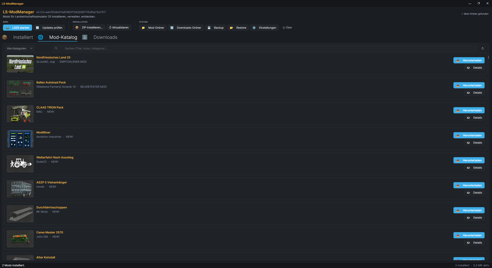

# LS-ModManager

[](https://github.com/Kroste/LS-ModManager/actions/workflows/ci.yml)
[](https://github.com/Kroste/LS-ModManager/releases)
[](LICENSE)

Mod-Manager für **Landwirtschaftssimulator 25 (LS25/FS25)** — Desktop-App für
Windows und Linux (C# / .NET 10 / Avalonia 12).



## Features

- **📦 Mods installieren:** ZIP auswählen oder direkt aus dem Mod-Katalog
  herunterladen — die App kopiert die Datei in den korrekten LS25-Mod-Ordner
  und liest Titel/Autor/Version/Beschreibung aus der `modDesc.xml`.
- **🌐 Drei Katalog-Quellen in einem Tab (~11.000 Mods gesamt):** Der offizielle
  GIANTS-Katalog von [farming-simulator.com/mods.php](https://www.farming-simulator.com/mods.php)
  **plus** der Community-Katalog von [modhoster.de](https://www.modhoster.de/spiel/ls-25)
  **plus** die „Hirschfeld-Version"-Community-Umbauten von
  [hof-hirschfeld.de](https://www.hof-hirschfeld.de/). Alle drei werden beim
  ersten Start parallel im Hintergrund geladen und persistent gecacht — Suche
  und Filtern sind danach instant. Community-Einträge sind mit einem Source-
  Badge markiert („Modhoster" / „Hof Hirschfeld") und öffnen für den Download
  den Browser (die beiden Community-Seiten verlangen Login bzw. Werbe-Consent).
- **🔍 Suche und Kategorien:** Live-Textfilter (Titel/Autor/Kategorie) plus
  Auswahl aus den GIANTS-Kategorien (Karten, Traktoren, Anhänger, …).
- **📥 Direkt herunterladen (GIANTS):** „Herunterladen"-Button pro Katalog-Karte
  lädt die ZIP samt Vorschaubild direkt vom offiziellen GIANTS-CDN. Der Download
  landet in einem persistenten Ordner (`Downloads`-Tab), von dort per Klick
  installierbar. Kein Browser-Umweg nötig.
- **👁 Detailansicht in-App:** Doppelklick oder „Details"-Button öffnet ein
  Fenster mit voller Beschreibung, allen Screenshots, Kategorie, Autor,
  Version, Größe, Bewertung. „Im Browser"-Button für den Fall der Fälle.
- **🔄 Update-Prüfung für installierte Mods:** „Updates prüfen" vergleicht die
  installierten Versionen mit dem Katalog. Bei neuerer Version erscheint
  Badge „⬆ Update: vX.Y" auf der Karte plus „⬇ Update installieren"-Button,
  der die neue Version lädt, die alte deinstalliert und die neue
  installiert (Aktiv/Deaktiviert-Status bleibt erhalten).
- **🚜 Spiel-Start aus der App:** „LS25 starten" ruft `steam://run/2300320`
  auf — Steam startet das Spiel, Windows und Linux (Proton).
- **⏻ Aktivieren/Deaktivieren:** Umbenennen zu `.zip.disabled` (LS25 ignoriert
  die Datei) — Mod bleibt vorhanden, wird aber nicht mehr geladen.
- **🖼 Vorschaubilder für praktisch jeden Mod:** PNG-Icons aus der Mod-ZIP werden
  extrahiert (Store-Bilder bevorzugt). Wenn nur `icon.dds` vorhanden ist —
  Standard bei vielen Community-Mods —, dekodiert die App die DDS (BC1/BC3/BGRA)
  intern zu PNG. Für Mods im GIANTS-Katalog wird zusätzlich das kuratierte
  CDN-Cover nachgeladen.
- **💾 Backup und Restore:** Komplette Mod-Konfiguration (aktivierte und
  deaktivierte Mods + Enabled-States) als selbstenthaltenes ZIP exportieren
  und auf einem anderen Rechner oder nach einem Neuaufsetzen wiederherstellen.
  Ideal für Sync zwischen mehreren Rechnern oder als Snapshot pro Karriere.
- **🆕 „NEU"-Badge im Katalog:** Einträge die beim letzten App-Start noch
  nicht im Katalog waren, bekommen einen grünen Marker auf der Card —
  einfacher Überblick was Community und ModHub seit dem letzten Besuch
  ergänzt haben.
- **🧰 Alltags-Komfort:**
  - Rechtsklick auf jede Installiert-Card: Details / Ordner im Dateimanager
    öffnen / Filename kopieren / Deinstallieren.
  - Sortierung (Name / Größe / Datum / Status) und Filter „nur mit Update"
    im Installiert-Tab; Katalog-Sortierung (Name / Autor / Kategorie).
  - Statusbar zeigt Gesamtgröße der aktiven Mods („12,3 GB aktiv") und
    echten Prozent-Fortschritt bei Downloads/Backup/Restore.
  - Doppelklick auf Installiert-Card öffnet das Detail-Fenster (wenn
    Katalog-Match vorhanden).
  - Keyboard-Shortcuts: **F5** = neu laden, **Ctrl+F** = Fokus Suchfeld,
    **Del** = markierte Mods deinstallieren (mit Rückfrage).
  - Bulk-Deinstallation fragt vor dem Löschen nach.
- **🇩🇪🇬🇧 Zweisprachige App-UI (Deutsch + Englisch):** Sprachauswahl im
  Einstellungen-Fenster mit Länderflaggen, Live-Umschaltung im Betrieb ohne
  Neustart. Community-Beiträge für weitere Sprachen willkommen (siehe
  `LSModManager/Localization/`).
- **🐧 Linux-Support:** Erkennt automatisch den LS25-Mod-Ordner im
  Steam-Proton-Präfix, egal auf welcher Platte Steam-Library liegt
  (`libraryfolders.vdf` wird geparst). Manueller Override in den Einstellungen.
- **🖥 System-Tray:** Fenster schließen beendet, minimieren legt es ins Tray.
- **⚙ Einstellungen:** Mod-Pfad, Katalog-Sprache (DE/EN/FR/ES/IT/PL),
  Katalog-Auto-Refresh-Intervall (1 h / 6 h / 12 h / 24 h / 7 Tage / nie).
- **🔄 App-Selbst-Update:** Prüft GitHub-Releases (proxy-fähig). Bei neuer
  Version im About-Dialog Klick auf „⬇ Update installieren" — die App lädt
  das passende Paket (Windows-ZIP / Linux-AppImage / Linux-tar.gz), startet
  einen kleinen Installer und ersetzt sich selbst.

## Installation

Fertige Pakete gibt es auf der
[Releases-Seite](https://github.com/Kroste/LS-ModManager/releases):

**Windows:** `LSModManager-X.Y.Z-win-x64.zip` herunterladen, entpacken,
`LSModManager.exe` starten. Keine Installation nötig (self-contained, .NET ist
enthalten).

**Linux (AppImage, empfohlen):** `LSModManager-X.Y.Z-x86_64.AppImage`
herunterladen, ausführbar machen und starten:

```bash
chmod +x LSModManager-*-x86_64.AppImage
./LSModManager-*-x86_64.AppImage
```

**Linux (tar.gz):** `LSModManager-X.Y.Z-linux-x64.tar.gz` entpacken und
`./LSModManager` starten.

## Bedienung

1. **Beim ersten Start** wird der Mod-Ordner automatisch erkannt (Windows:
   `Dokumente\My Games\FarmingSimulator2025\mods`; Linux: Steam-Proton-Präfix
   auf allen Steam-Libraries). Falls die Erkennung fehlschlägt, in ⚙
   *Einstellungen* einen manuellen Pfad setzen. Der Katalog (~11.000 Mods aus
   drei Quellen) wird im Hintergrund geladen — Statusbar zeigt den Fortschritt.
2. **Installierte Mods verwalten (Tab „📦 Installiert"):** Live-Suche oben
   (Titel/Autor/Dateiname). Karten mit Icon, Titel, Autor, Version, Status.
   Pro Karte rechts: „⏻ (De-)Aktivieren", „🗑 Deinstallieren", und bei
   verfügbarem Update zusätzlich „⬇ Update installieren". **Mehrere Mods
   markieren** (Ctrl-Klick / Shift-Klick) blendet oben eine Bulk-Leiste
   ein: „⏻ Alle aktivieren / deaktivieren / 🗑 alle deinstallieren".
3. **Neue Mods entdecken (Tab „🌐 Mod-Katalog"):** Kategorie-Dropdown +
   Live-Suche links. Pro Karte „📥 Herunterladen" (lädt direkt in den
   Downloads-Ordner) und „👁 Details" (Detailfenster mit Screenshots und
   Beschreibung). Doppelklick auf eine Karte öffnet ebenfalls die Details.
4. **Heruntergeladen (Tab „⬇ Downloads"):** Liste aller heruntergeladenen
   ZIPs. Pro Karte „📥 Installieren" (kopiert in Mod-Ordner) und „🗑 Löschen".
5. **Manuelle ZIP-Installation:** Toolbar → „📦 ZIP installieren…" → Dateiwahl.
   Alternativ: **eine oder mehrere ZIPs direkt auf's App-Fenster ziehen**
   — sie werden sequentiell installiert.
6. **Updates prüfen:** Toolbar → „🔄 Updates prüfen" — die App vergleicht alle
   installierten Versionen mit dem Katalog, markiert veraltete Mods mit einem
   Update-Badge und Update-Button.
7. **Spiel starten:** Toolbar → „🚜 LS25 starten" — öffnet LS25 über Steam.
8. **Ordner öffnen:** Toolbar → „📁 Mod-Ordner" bzw. „⬇ Downloads-Ordner".
9. **Backup und Restore:** Toolbar → „💾 Backup" schreibt alle installierten
   Mods (aktiv + deaktiviert) plus Enabled-States in ein ZIP-Archiv.
   „📂 Restore" liest so ein ZIP wieder ein und stellt den kompletten Zustand
   wieder her — funktioniert auch auf einem frisch aufgesetzten Rechner ohne
   Internet-Verbindung.

## Einstellungen

- **App-Sprache:** Deutsch oder Englisch — Live-Umschaltung ohne Neustart.
  Weitere Sprachen als Community-PR (siehe `LSModManager/Localization/`).
- **LS25-Mod-Ordner:** Auto-Erkennung + manueller Override. Der erkannte Pfad
  wird angezeigt und kann per „Neu erkennen" aufgefrischt werden.
- **Katalog-Sprache:** DE/EN/FR/ES/IT/PL — bestimmt, in welcher Sprache Titel
  und Kategorien vom GIANTS-ModHub geladen werden.
- **Katalog-Cache-Refresh:** Wählbar zwischen „bei jedem Start neu",
  1 h / 6 h / 12 h / 24 h (Default) / 7 Tage / nie. Der ↺-Button im
  Katalog-Tab erzwingt immer einen Refresh.

Konfiguration liegt unter `%APPDATA%\LSModManager\settings.json` (Windows) bzw.
`~/.config/LSModManager/settings.json` (Linux). Katalog- und Preview-Cache
unter `%LOCALAPPDATA%\LSModManager\cache\` (Windows) bzw.
`~/.cache/LSModManager/` (Linux).

## Logs & Fehlersuche

Logdateien liegen im Unterordner `logs/` neben der Anwendung (Tagesarchiv,
14 Tage). **Schnellzugriff:** *Über* → „📁 Log-Ordner" öffnet den Ordner
direkt im Dateimanager. Bei einem Problem bitte ein Issue mit der aktuellen
Logdatei eröffnen — Passwörter und Tokens werden automatisch maskiert.

## Entwicklung

```bash
dotnet build            # bauen
dotnet test             # Tests
dotnet run --project LSModManager
```

Release: VS-Code-Task „release (tag + push)" — prüft den Git-Zustand, setzt den
Tag und stößt die GitHub-Action an, die alle Pakete (win-x64 ZIP, linux-x64
tar.gz, AppImage) baut.

## Rechtliches

Diese App ist **kein offizielles Produkt** von GIANTS Software. Katalog- und
Detail-Seiten des offiziellen ModHubs werden mit gebremster Rate (300 ms zwischen
Seiten) lesend abgefragt. Der In-App-Download vom GIANTS-CDN imitiert genau das,
was ein Klick auf „Download" auf der Detail-Seite tut — keine Login-Session,
kein Rate-Limit-Umgehen, transparenter User-Agent. Modhoster- und Hof-Hirschfeld-
Downloads werden bewusst an den Browser des Nutzers delegiert, weil diese Seiten
Login bzw. Werbe-Consent voraussetzen.

## Lizenz

MIT — siehe [LICENSE](LICENSE).

---

☕ Gefällt dir das Tool? [Buy me a coffee](https://buymeacoffee.com/kroste)
